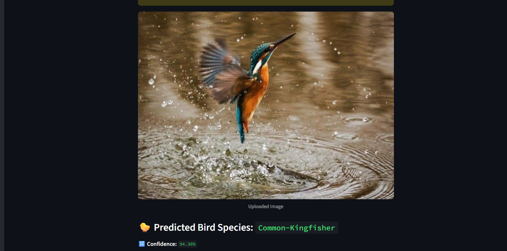

# 🐦 Bird Species Classifier

A deep learning-powered web app that classifies 25 Indian bird species from images using a fine-tuned MobileNet model. Built with TensorFlow and deployed using Streamlit.

---

## Features

- Upload an image or provide an image URL
- Predicts the top 3 bird species with confidence scores
- Built using a pre-trained MobileNet CNN model
- Trained on a dataset of 25 bird species (30,000+ images)
- Lightweight and runs in your browser with no setup

---

## Model Info

- **Model**: MobileNet (transfer learning)
- **Accuracy**: ~95% validation accuracy after fine-tuning
- **Input**: 224x224 RGB image
- **Output**: One of 25 bird species

## How to Run Locally

### 1. Clone this repository
git clone https://github.com/Shivanishibu04/Bird-Classifier.git  

cd Bird-Classifier

### 2. Set up virtual environment (Windows)
python -m venv venv  

venv\Scripts\activate  

pip install -r requirements.txt  

### 3. Launch the app
streamlit run bird_classifier_app.py

## Dataset
This project uses the “25 Indian Bird Species with 22.6k Images” dataset available on Kaggle:

 Dataset Name:
25 Indian Bird Species
Link - https://www.kaggle.com/datasets/arjunbasandrai/25-indian-bird-species-with-226k-images

Source:
Images collected from eBird Media

Description:
- Contains ~22,600 high-quality images
- Covers 25 commonly found bird species in India
- Images are distributed into training and testing folders, organized by class
- Excellent dataset for transfer learning and fine-tuning deep learning models

## Tech Stack
This project leverages the following tools and technologies:

## Backend / Model Development
- Python 3.10+ — Programming language
- TensorFlow / Keras — For building and training the CNN model
- NumPy & Pandas — Data manipulation and preprocessing
- Matplotlib & Seaborn — For visualizations (e.g., accuracy/loss plots, confusion matrix)
- scikit-learn — Evaluation metrics and utilities

## Frontend / Deployment
Streamlit — Lightweight web framework to deploy and interact with the model

Colab Notebook Link - https://colab.research.google.com/drive/1_QPebOTlxmyOnxTtja22dxb8ZhMjraEt?usp=sharing 
